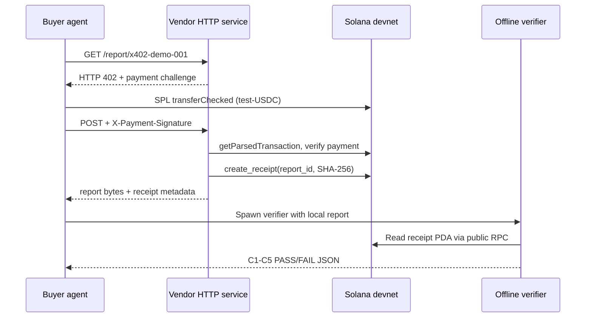

# AgentToll

AgentToll 是 Solana 上的 AI 代理交付回执协议。Vendor 将报告原始字节的 SHA-256 digest 写入公开 PDA；买方可以独立读取链上数据并在本地重新计算 digest，不需要信任 vendor 的服务。

W3 demo 使用 **test-USDC (self-issued devnet mint)**，它只是 devnet 演示代币，不是真实 USDC，也没有现实货币价值。

## 架构



## 环境要求

- Node.js 22+
- 可访问的 Solana devnet RPC
- 已部署的 AgentToll 程序：`8ACN1KNEFXM2N2FMzxTfAzB1c3g5n47ZuhbPoUXPnCTp`
- 有 devnet SOL 的 vendor keypair

安装唯一的 JavaScript 依赖集：

```bash
cd verifier
npm install
cd ..
```

运行时依赖仅为 `@solana/web3.js` 和 `@solana/spl-token@0.4.9`；HTTP 服务使用 Node 内置 `http`。

## 配置环境变量

Bash：

```bash
export AGENTTOLL_RPC_URL='https://api.devnet.solana.com'
export AGENTTOLL_KEYPAIR='/absolute/path/to/vendor-keypair.json'
# 可选；未设置时 setup 生成 demo/buyer-keypair.json
export AGENTTOLL_BUYER_KEYPAIR='/absolute/path/to/buyer-keypair.json'
```

PowerShell：

```powershell
$env:AGENTTOLL_RPC_URL = 'https://api.devnet.solana.com'
$env:AGENTTOLL_KEYPAIR = 'C:\path\to\vendor-keypair.json'
# 可选
$env:AGENTTOLL_BUYER_KEYPAIR = 'C:\path\to\buyer-keypair.json'
```

所有 keypair 都只通过文件路径读取。`demo/buyer-keypair.json` 和 `demo/config.json` 已被 `.gitignore` 排除。

## 1. 幂等准备 devnet 资产

```bash
node demo/setup.mjs
node demo/setup.mjs
```

第一次执行创建 6 decimals 的 test-USDC (self-issued devnet mint)、vendor/buyer ATA，确保买家持有 100 test-USDC，并确保买家有 0.05 devnet SOL。第二次执行复用现有配置和账户。

## 2. 启动 vendor

```bash
node demo/vendor.mjs
```

服务只监听 `127.0.0.1:8787`。可通过 `PORT` 覆盖端口。另开一个终端确认未付款请求得到 HTTP 402：

```bash
curl -i http://127.0.0.1:8787/report/x402-demo-001
```

响应包含 `X-Payment-Required`，金额 `10000` base units，即 0.01 test-USDC。

## 3. 运行买方代理

```bash
node demo/buyer-agent.mjs
```

买方代理自动执行：获取 402 挑战、发送 `transferChecked`、携付款签名重新请求、保存报告、spawn W2 verifier。成功时 stdout JSON 包含：

- `payment_sig`
- `receipt_tx`
- `pda`
- `verifier_verdict: "PASS"`
- C1-C5 `checks`

## 4. 验证拒绝假付款

Bash：

```bash
curl -i -X POST \
  -H 'X-Payment-Signature: not-a-real-signature' \
  http://127.0.0.1:8787/report/x402-demo-001
```

PowerShell：

```powershell
curl.exe -i -X POST -H "X-Payment-Signature: not-a-real-signature" http://127.0.0.1:8787/report/x402-demo-001
```

预期结果是 HTTP 402 和明确原因；响应不得包含报告。

## 5. 独立验证报告

W2 verifier 可脱离 vendor HTTP 服务运行：

```bash
node verifier/verify.mjs \
  --url "$AGENTTOLL_RPC_URL" \
  --vendor <VENDOR_PUBKEY> \
  --report-id x402-demo-001 \
  --file demo/buyer-report.json
```

它执行 ownership、PDA 派生、schema、内容绑定、时间/vendor 五项检查。详情见 [verifier/README.md](verifier/README.md)。

## 安全与验收检查

```bash
node --check demo/setup.mjs
node --check demo/vendor.mjs
node --check demo/buyer-agent.mjs
node --check verifier/verify.mjs
git diff -- programs/agenttoll/src
git status --short
```

`git diff -- programs/agenttoll/src` 在 W3 阶段应为空。交易签名必须来自实际 devnet 运行；本文档不提供或伪造验收签名。
