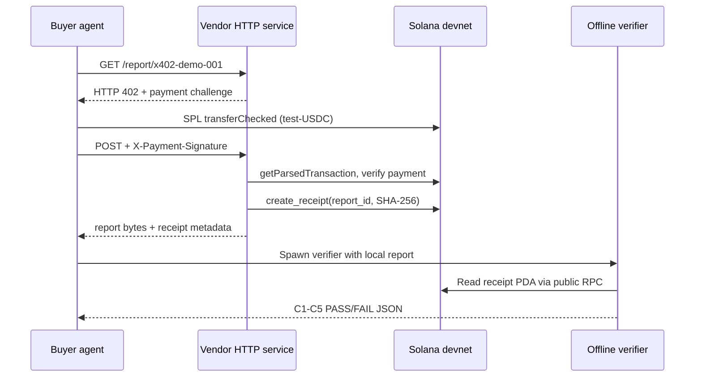

# ReceiptRail (formerly AgentToll) — on-chain delivery receipts for x402

[](https://github.com/xka0085-byte/agenttoll/actions/workflows/ci.yml)

**ReceiptRail** is an on-chain delivery-receipt service for x402 AI-agent payments on Solana: after a settlement, sellers anchor a SHA-256 digest of the delivered content plus the settlement reference into a public PDA. Anyone — the buyer agent, an auditor, a regulator — can independently verify what was delivered, **without trusting the vendor, the buyer, or any API we operate**.

## ⚡ Live service (use it now)

| Surface | Entry |
|---|---|
| MCP endpoint (streamable-http) | `https://agenttoll-receipts.app.workbuddy.host/mcp` |
| Official MCP Registry | `io.github.xka0085-byte/receiptrail` |
| npm (stdio MCP bridge) | `npx -y receiptrail-mcp` |
| Agent Card / SKILL.md / llms.txt | `/.well-known/agent-card.json` · `/SKILL.md` · `/llms.txt` |
| Pricing (0.001 USDC/receipt via x402) | https://agenttoll-receipts.app.workbuddy.host/ |
| Tools | `issue_receipt` · `verify_receipt` · `get_receipt` |

Keywords for agent discovery: x402 receipt, x402 escrow, delivery receipt, proof of delivery, Solana, USDC, MCP, AI-agent payments, verifiable settlement, receipt verification.

---

AgentToll is the delivery-receipt protocol behind ReceiptRail. A vendor pins the SHA-256 digest of a report's exact bytes into a public PDA account on-chain. Anyone can independently recompute the digest from the delivered file and compare it against the chain, without trusting anyone.

> **"Don't trust what we say. Run the command."**
> Every capability claim in this README maps to a command in this repo and, where possible, a Solscan link on devnet.

**Status**: W1–W3 complete, independently audited (reports in [`audit/`](audit/)). Deployed on Solana devnet.

- Program ID: `8ACN1KNEFXM2N2FMzxTfAzB1c3g5n47ZuhbPoUXPnCTp` — [view on Solscan](https://solscan.io/account/8ACN1KNEFXM2N2FMzxTfAzB1c3g5n47ZuhbPoUXPnCTp?cluster=devnet)
- Receipt created by the recorded demo payment flow: [delivery tx](https://solscan.io/tx/25pCWs53mE6cMRyFfjxEYc5hVf3XhPWGKegLyLiZFhsqtRVJUDtWGBwMgFmWDurSfoSrBpKNwsraanePBpakNU4u?cluster=devnet) · [payment tx](https://solscan.io/tx/5KAvtPuLVCHBJwd17rM2RGTS6KzGj7gyjQQXMZFTY4Fs5iTnnkSAKepps9cRFLSqdM2WXAWhJSMP7m6SdQiuxWSN?cluster=devnet)

**Honesty note**: the demo uses **test-USDC, a self-issued devnet mint** with no real-world value. It is not real USDC. We say so everywhere, including in code output.

## Why this exists

Machine-to-machine payments (the x402 pattern) are becoming real: agents pay per API call. But after an agent pays, it holds **no trustworthy proof** of *what* it received. Receipts, invoices, or hashes served by the vendor itself are indistinguishable from fabricated ones. AgentToll moves that proof to a neutral public ledger: the digest is written once, is tamper-evident (same id + different digest is rejected on-chain), and is verifiable offline forever.

## Verify an existing receipt right now (no vendor involved)

```bash
cd verifier && npm install && cd ..
node verifier/verify.mjs \
  --url https://api.devnet.solana.com \
  --vendor B7wGaKwEGAmNP7PEhqwFrvfCQPH4zwiE7FZNLoeB4naD \
  --report-id x402-demo-001 \
  --file demo/report-402.json
```

Expected: JSON with `"verdict": "PASS"` and all five checks `true` (C1 ownership, C2 PDA derivation, C3 schema, C4 content binding, C5 freshness). Exit code 0. Then tamper with the file (add one byte) and rerun — C4 fails, exit code 1. **That mismatch is the product.**

## Architecture



The on-chain program enforces the anti-tamper rule at the ledger level: a PDA seeded by `(vendor, report_id)` can be created once; re-creating with the same digest is idempotent, with a different digest fails with `DigestConflict`. Overwrites are impossible, not just discouraged.

## Run the full x402 demo

Requires Node.js 22+, a devnet-funded vendor keypair, and the deployed program above.

```bash
# 0. install the single JS dependency set
cd verifier && npm install && cd ..

# 1. configure (bash example)
export AGENTTOLL_RPC_URL='https://api.devnet.solana.com'
export AGENTTOLL_KEYPAIR='/absolute/path/to/vendor-keypair.json'

# 2. create test-USDC mint, fund buyer (idempotent)
node demo/setup.mjs

# 3. start vendor (localhost:8787)
node demo/vendor.mjs

# 4. unpaid request must be refused
curl -i http://127.0.0.1:8787/report/x402-demo-001        # → HTTP 402

# 5. run the buyer agent: pay → receive report+receipt → verify 5/5
node demo/buyer-agent.mjs

# 6. forged payment signatures must be rejected
curl -i -X POST -H 'X-Payment-Signature: not-a-real-signature' \
  http://127.0.0.1:8787/report/x402-demo-001              # → HTTP 402, no report
```

`demo/buyer-agent.mjs` prints `{payment_sig, receipt_tx, pda, verifier_verdict, checks}` and exits 0 only if the spawned offline verifier passes all five checks.

## On-chain program (W1)

Anchor 1.2.0, two instructions:

- `create_receipt(report_id, digest)` — first call creates the PDA; same id + same digest is idempotent; same id + different digest → `DigestConflict`
- `verify_receipt(report_id, digest)` — permissionless; emits a `ReceiptVerified` event

Build and test locally:

```bash
./build.sh        # = anchor build --arch v0
cargo test --all  # 8 litesvm tests, incl. DigestConflict & idempotency
```

## Audits

Every milestone was reviewed by an independent auditor that did not write the business code. Reports with command outputs and on-chain evidence:

- [`audit/W1-2026-09-14.md`](audit/W1-2026-09-14.md) — contract, 8/8 tests, devnet deployment
- [`audit/W2-2026-09-14.md`](audit/W2-2026-09-14.md) — offline verifier, tamper-detection e2e
- [`audit/W3-2026-09-14.md`](audit/W3-2026-09-14.md) — x402 flow, negative paths, idempotent replay

## Scope & limitations (read before trusting anything)

- **test-USDC is self-issued** on devnet; it stands in for a real stablecoin. No real value.
- The demo serves **one report id** on localhost; it is a protocol demo, not a hosted service.
- The on-chain receipt binds `report_id + digest`; the **payment signature is linked via the demo flow, not stored on-chain** (the frozen W1 schema has no such field). See W3 audit §findings.
- A professional third-party security audit is on the roadmap and has **not** happened yet.

## Disclosed prior work

This project was built for the Colosseum CWF hackathon. Per the rules, we disclose pre-existing development: [t3n-recon-agent](https://github.com/xka0085-byte/t3n-recon-agent) and [z-tenant-recon](https://github.com/xka0085-byte/z-tenant-recon) — a TEE-based prototype implementing the same anti-tamper digest logic (same-id-different-digest rejection, independent verifier), from which the on-chain design was ported. All AgentToll commits, tests, and deployments happened during the competition window (first commit: 2026-09-14).

中文说明见 [README.zh-CN.md](README.zh-CN.md)。
